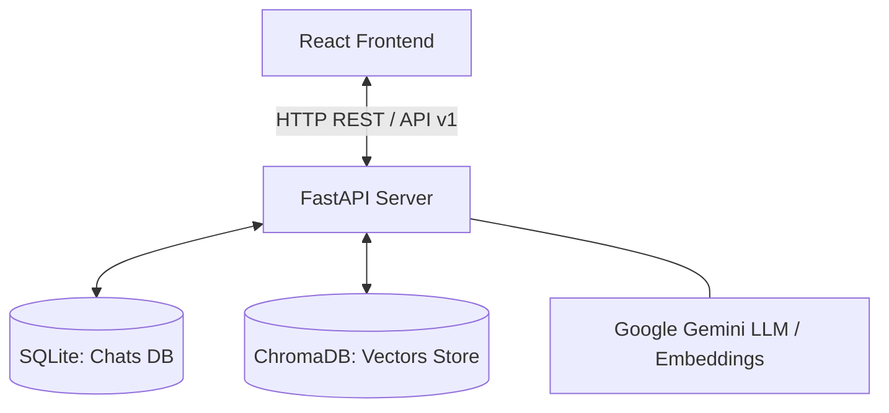

# 📄 DocuChat AI — Multi-Client PDF RAG System

<div align="center">
  
  
  
  
  
</div>

<p align="center">
  <strong>A full-stack, enterprise-grade Retrieval-Augmented Generation (RAG) platform to upload, index, and chat with your PDFs using Google Gemini AI, LangChain, and ChromaDB.</strong>
</p>

---


---

## 📋 Table of Contents
* [🌟 Features](#-features)
* [🏗️ Architecture](#%EF%B8%8F-architecture)
* [🛠️ Tech Stack](#%EF%B8%8F-tech-stack)
* [🚀 Getting Started](#-getting-started)
  * [Prerequisites](#prerequisites)
  * [Backend Setup](#backend-setup)
  * [Frontend Setup](#frontend-setup)
* [🔑 Environment Variables Reference](#-environment-variables-reference)
* [📡 API Routes Reference](#-api-routes-reference)
* [📁 Project Structure](#-project-structure)

---

## 🌟 Features

* **📤 Isolated Client Sessions**: Browser/Client ID header mapping guarantees that files and chat histories remain strictly separated between different users.
* **🧠 Advanced Chunking & Embedding**: Employs LangChain's semantic chunk splitters (`chunk_size=800`, `overlap=100`) and stores dense vector representations in a persistent ChromaDB instance.
* **💬 Session-Based Persistent Chat**: Create, rename, view, or delete multiple chat histories backed by a local SQLite database (via SQLAlchemy ORM).
* **📊 RAG Analytics Panel**: Visually inspect the RAG engine metrics including execution times, similarity scores, underlying queries, and the exact formatted prompt templates sent to the LLM.
* **🔍 Source Citations**: Instantly highlights referenced passages showing page numbers and the matching context snippets in responsive source cards.
* **✨ Premium Responsive UI**: Built with a sleek dark-themed workspace, smooth desktop layouts, glassmorphism elements, and fully responsive mobile views.

---

## 🏗️ Architecture



### Data Flow
1. **Upload**: PDF is parsed by the backend (`PyPDF`) and saved in the user's filesystem directory.
2. **Ingestion**: Text is chunked, converted into vector embeddings, and indexed in `ChromaDB` labeled with the user's Client ID.
3. **Retrieval**: When a query is made, ChromaDB executes a similarity search to fetch relevant context snippets.
4. **Generation**: The context is injected into a custom prompt template and processed by Google Gemini (`gemini-pro`).
5. **Citations & Metrics**: Response returns side-by-side citations and diagnostic analytics.

---

## 🛠️ Tech Stack

### Backend
* **Web Framework:** FastAPI (Asynchronous lifespan handlers)
* **LLM Orchestration:** LangChain (`langchain-google-genai`)
* **Vector Store:** ChromaDB (Persistent storage)
* **Metadata Database:** SQLite + SQLAlchemy ORM
* **Server:** Uvicorn (Hot-reloading enabled)

### Frontend
* **UI Library:** React (Vite-powered SPA)
* **Styling:** TailwindCSS (Dark-theme preset)
* **Animations:** Framer Motion (Transitions & alerts)
* **Icons:** Lucide React

---

## 🚀 Getting Started

### Prerequisites
Ensure you have the following installed locally:
* **Python** (>= 3.9)
* **Node.js** (>= 18.x)
* **npm** (>= 9.x)

---

### Backend Setup
1. **Navigate to the Backend directory:**
   ```bash
   cd backend
   ```
2. **Create and activate a virtual environment:**
   ```bash
   python -m venv .venv
   
   # Windows:
   .venv\Scripts\activate
   
   # macOS/Linux:
   source .venv/bin/activate
   ```
3. **Install python dependencies:**
   ```bash
   pip install -r requirements.txt
   ```
4. **Setup environment file:**
   Copy `.env.example` to `.env` and fill in your Gemini credentials:
   ```bash
   cp .env.example .env
   ```
5. **Start the FastAPI backend server:**
   ```bash
   python -m app.main
   ```
   *The API will start running at* `http://localhost:8000`

---

### Frontend Setup
1. **Navigate to the Frontend directory:**
   ```bash
   cd ../frontend
   ```
2. **Install node packages:**
   ```bash
   npm install
   ```
3. **Start the development server:**
   ```bash
   npm run dev
   ```
   *The client interface will start running at* `http://localhost:5173`

---

## 🔑 Environment Variables Reference

### Backend (`backend/.env`)
```ini
# Google Gemini API Key (Get key at: https://aistudio.google.com/app/apikey)
GEMINI_API_KEY=your_gemini_api_key_here

# Persistent Vector Store Configuration
CHROMA_DB_PATH=./vectorstore

# Physical Uploads Directory
UPLOAD_DIR=./uploads

# Max Upload Size (20 MB in bytes)
MAX_FILE_SIZE=20971520

# Server Running Config
APP_HOST=0.0.0.0
APP_PORT=8000
DEBUG=true

# Allowed CORS Origins (comma-separated list)
CORS_ORIGINS=http://localhost:5173,http://localhost:3000
```

---

## 📡 API Routes Reference

All backend REST API endpoints are prefixed with `/api/v1`

| Method | Endpoint | Description |
| :--- | :--- | :--- |
| **GET** | `/health` | Server status checks |
| **POST** | `/upload` | Receives and stores a PDF document |
| **POST** | `/process` | Chunks, embeds, and stores documents in ChromaDB |
| **POST** | `/chat` | Queries the RAG system using conversation context |
| **GET** | `/chats` | Retrieves all chat history list |
| **GET** | `/chats/{session_id}` | Fetches message items from a specific chat |
| **DELETE** | `/chats/{session_id}` | Deletes a chat session |
| **GET** | `/documents` | Lists all uploaded and processed PDFs |
| **DELETE**| `/document/{document_id}` | Removes a PDF from filesystem and ChromaDB |

---

## 📁 Project Structure

```
RAG/
├── backend/
│   ├── app/
│   │   ├── api/            # API Route definitions
│   │   ├── db/             # SQLAlchemy schemas & connections
│   │   ├── models/         # Pydantic schemas
│   │   ├── rag/            # Vector store, embedders & processors
│   │   ├── services/       # Chat generation and history utilities
│   │   └── main.py         # Entrypoint script
│   ├── chats.db            # SQLite database file
│   ├── requirements.txt    # Python packaging dependencies
│   └── .env                # Server credentials configuration
│
├── frontend/
│   ├── src/
│   │   ├── components/     # UI elements (Header, ChatInput, Sidebar)
│   │   ├── pages/          # View Pages (Landing, Chat)
│   │   └── index.css       # Core Tailwind styles
│   ├── tailwind.config.js  # Styling setups
│   └── package.json        # Node dependencies package configuration
└── README.md               # Main repository documentation
```
